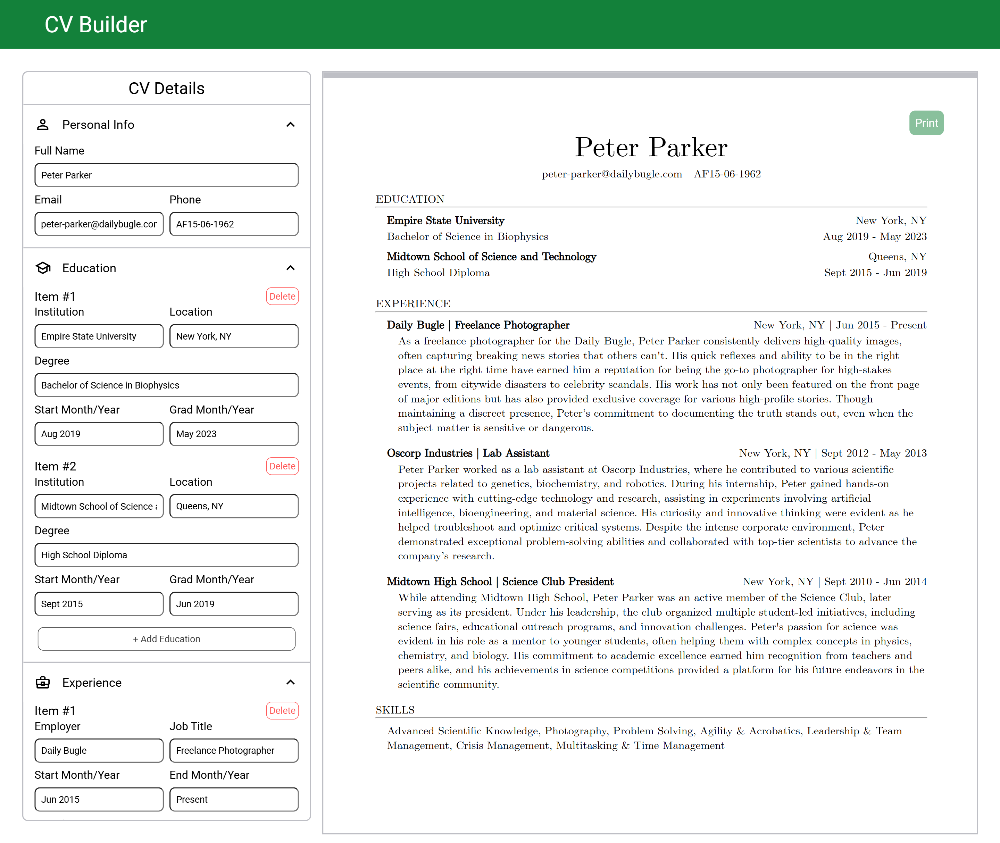

# CV Builder

This is a web application that helps you easily create a professional CV.



## Features

- **Live Preview:** See your CV update in real-time as you add/edit sections.
- **Customizable Sections:** Add or modify personal details, education, work experience, and skills.
- **Export as PDF:** Once you're done, easily download your CV as a PDF.

## Technologies Used

- JavaScript
- HTML/CSS
- React

## Installation

- Clone the repository:

```bash
git clone https://github.com/ZohairGandhi/cv-app.git
```

- Install dependencies:

```bash
npm install
```

- Build the app:

```bash
npm run build
```

## Usage

You can access the deployed app directly via [this link](https://thriving-banoffee-fd2ab4.netlify.app/). Alternatively, you can run `npm run preview` after building the app which will boot up a local static web server at `http://localhost:4173`.
